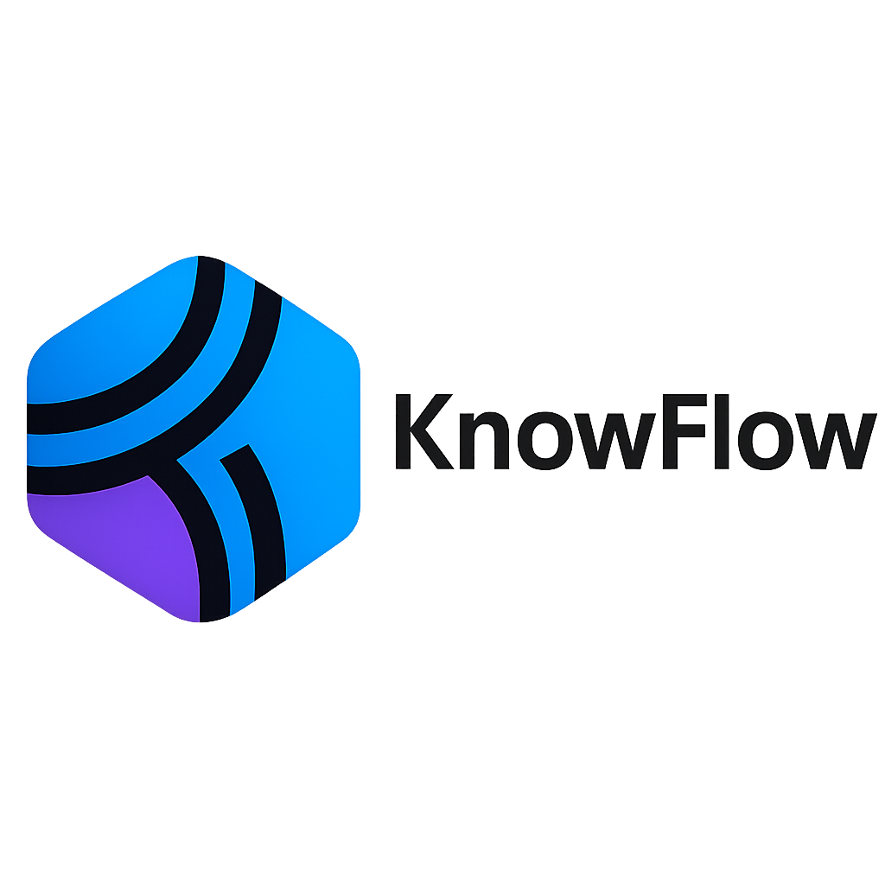

<div align="center">
  
</div>

<p align="center">
  <a href="./README.md">English</a> |
  <a href="./README_zh.md">简体中文</a> 
</p>

# 🌌 LAYRA: A Visual-First Retrieval Agent Beyond OCR

> **Forget tokenization. Forget layout loss.**  
> With pure visual embeddings, LAYRA understands documents like a human — page by page, structure and all.

**LAYRA** is a next-generation Retrieval-Augmented Generation (RAG) system powered by **pure visual embeddings**. It treats documents not as sequences of tokens but as visually structured artifacts — preserving layout, semantics, and graphical elements like tables, figures, and charts.

Built for both research exploration and enterprise deployment, LAYRA features:

- 🧑‍💻 **Modern frontend stack**: TypeScript-based [Next.js 15](https://nextjs.org/blog/next-15) and [TailwindCSS 4.0](https://tailwindcss.com) — delivering a snappy, responsive, and developer-friendly interface.
- ⚙️ **Async-first backend architecture**: Built on [FastAPI](https://github.com/fastapi/fastapi), seamlessly integrated with fully asynchronous components including **Redis**, **MySQL**, **MongoDB**, and **MinIO**, optimized for high-performance data flow and scalability.
- 🧠 **Visual-first multimodal foundation**: Uses [Qwen2.5-VL](https://github.com/QwenLM/Qwen2.5-VL) series  as the current default large language model, with plans to support **GPT-4o**, **Claude**, **Gemini**, and other multimodal models in future releases.
- 🎯 **Image-level embedding**: Document parsing and visual embedding is powered by the [Colpali](https://github.com/illuin-tech/colpali) project — using the [colqwen2.5](https://huggingface.co/vidore/colqwen2.5-v0.2) to convert pages into rich semantic vectors stored in [Milvus](https://milvus.io/).

> LAYRA aims to be an **enterprise-ready, plug-and-play visual RAG platform**, bridging unstructured document understanding with multimodal AI.

🚧 **Currently in active development**:  
The first test version is now available for trial, with support for **PDF documents only**.  
📚 Future releases will add support for more document types (e.g., Word, PPT, Excel, images, Markdown).  
📈 For details, see the [Roadmap](#-roadmap).

---

## 📚 Table of Contents

- [Latest Updates](#-latest-updates)
- [Why LAYRA?](#-why-layra)
- [First Trial Version Available](#-first-trial-version-available)
- [System Architecture](#-system-architecture)
- [Query Flow](#-query-flow)
- [Upload & Indexing Flow](#-upload--indexing-flow)
- [Key Features](#-key-features)
- [Tech Stack](#-tech-stack)
- [Deployment](#-deployment)
- [Use Cases](#-use-cases)
- [Roadmap](#-roadmap)
- [Contributing](#-contributing)
- [Contact](#-contact)
- [Star History](#-star-history)
- [License](#-license)

---

## 🚀 Latest Updates

- **(2025.4.6) First Trial Version Now Available**:  
  The first testable version of LAYRA has been released! Users can now upload PDF documents, ask questions, and receive layout-aware answers. We’re excited to see how this feature can help with real-world document understanding.

- **Current Features**:  
  - PDF batch upload and parsing functionality
  - Visual-first retrieval-augmented generation (RAG) for querying document content
  - Backend fully optimized for scalable data flow with **FastAPI**, **Milvus**, **Redis**, **MongoDB**, and **MinIO**

- **Upcoming Features**:  
  - Expanded document format support (Word, PPT, Excel, and images)
  - Support for additional large models, including **GPT-4o** and **Claude**
  - Integration of intelligent agent for multi-hop reasoning and advanced document analysis

Stay tuned for future updates and feature releases!
---


## ❓ Why LAYRA?

Most RAG systems rely on OCR or text-based parsing to process documents. But these approaches:

- ❌ **Lose layout fidelity** (columns, tables, hierarchy collapse)
- ❌ **Struggle with non-text visuals** (charts, diagrams, figures)
- ❌ **Break semantic continuity** due to poor OCR segmentation

**LAYRA changes this.**

> 🔍 It sees each page of the document as a whole — just like a human reader.

By using **pure visual embeddings**, LAYRA preserves:
- ✅ Layout structure (headers, lists, sections)
- ✅ Tabular integrity (rows, columns, merged cells)
- ✅ Embedded visuals (plots, graphs, stamps, handwriting)
- ✅ Multi-modal consistency between layout and content

---

## 🧪 First Trial Version Available

> ✅ **The first testable version of LAYRA is now available!**  
> Upload your own PDF documents, ask questions, and receive layout-aware answers.

You can now explore the first version, which supports PDF uploads and returns questions about your documents with visual layout context.

### Screenshots:

1. **Homepage — Get start**
   

2. **Knowledge Base — Upload your document and view files**
   

3. **Interactive Dialogue — Ask and get layout-preserving answers**
   
   

---


## 🧠 System Architecture

LAYRA’s pipeline is designed for **async-first**, **visual-native**, and **scalable document retrieval and generation**.

### 🔍 Query Flow
The query goes through embedding → vector retrieval → anser generation:


### 📤 Upload & Indexing Flow
PDFs are parsed into images and embedded visually via ColQwen2.5, with metadata and files stored in appropriate databases:


---

## ✨ Key Features

| Feature | Description |
|--------|-------------|
| 🧠 **Visual-First RAG** | Embeds raw document images without relying on OCR |
| 🧾 **Layout-Preserving QA** | Understands tables, headers, and multi-column layouts |
| 📊 **Visual Content Support** | Parses and reasons over plots, diagrams, and charts |
| ⚙️ **Async Document Parsing** | Background document processing via Kafka |
| 🔍 **Fast Vector Search** | Powered by Milvus for scalable dense retrieval |
| 🤖 **Flexible LLM Backend** | Supports Qwen2.5-VL series, and extensible to GPT-4o, Claude 3, etc. |
| 🌐 **Modern Web UI** | Built with Next.js + Typescript + TailwindCSS + Zustand |

---

## 🧰 Tech Stack

**Frontend**:  
- `Next.js`, `TypeScript`, `TailwindCSS`, `Zustand`

**Backend & Infrastructure**:  
- `FastAPI`, `Kafka`, `Redis`, `MySQL`, `MongoDB`, `MinIO`, `Milvus`

**Models & RAG**:  
- Embedding: `colqwen2.5-v0.2`  
- LLM Serving: `VLM  (Qwen2.5-VL series)`

---

## 🚀 Deployment

### ▶️ Local Development

```bash
# Clone the repo
git clone https://github.com/liweiphys/layra.git
cd layra

# Set up database and FastAPI environment configuration
vim .env
vim web/.env.local 
vim gunicorn_config.py
# Or use default settings

# Launch Milvus, Redis, MongoDB, Kafka, and MinIO via Docker Compose.
cd docker
sudo docker-compose -f milvus-standalone-docker-compose.yml -f docker-compose.yml up -d

# Back to project root
cd ../

# Install Python 3.10.6 and create virtual environment (optional)
# python -m venv venv && source venv/bin/activate
# Or install with conda
conda create --name layra python=3.10
conda activate layra

# Install dependencies
pip install -r requirements.txt

# Download ColQwen2.5 model weights
# ⚠️ If Git LFS not installed, run:
git lfs install

# Download base model weights
git clone https://huggingface.co/vidore/colqwen2.5-base
# For users in China:
# git clone https://hf-mirror.com/vidore/colqwen2.5-base

# Download LoRA fine-tuned weights
git clone https://huggingface.co/vidore/colqwen2.5-v0.2
# For users in China:
# git clone https://hf-mirror.com/vidore/colqwen2.5-v0.2

# Modify the `base_model_name_or_path` field in `colqwen2.5-v0.2/adapter_config.json`
base_model_name_or_path="/absolute/path/to/colqwen2.5-base"
# Set it to local path of colqwen2.5-base

# Set the following in your .env file
COLBERT_MODEL_PATH="/absolute/path/to/colqwen2.5-v0.2"

# Initialize MySQL database
alembic init migrations
cp env.py migrations
alembic revision --autogenerate -m "Init Mysql"
alembic upgrade head

# Start backend with Gunicorn
gunicorn -c gunicorn_config.py app.main:app
# http://localhost:8000

# Start ColBERT embedding model server
python model_server.py

# Frontend development
cd web
npm install
npm run dev  
# http://localhost:3000

# Or build frontend (recommended)
# cd web
# npm install
# npm run build
# npm start  # http://localhost:3000
```

> 🧪 Note: Milvus, Redis, MongoDB, Kafka, and MinIO are expected to run locally or via Docker.

#### 🎉 Enjoy!
Now that everything is up and running, enjoy exploring and building with Layra! 🚀

### ▶️ Future Deployment Options

In the future, we will support multiple deployment methods including Docker, Kubernetes (K8s), and other containerized environments. More details will be provided when these deployment options are available.

---

## 📚 Use Cases

- 🧾 **Intelligent document QA**: Contracts, invoices, scanned reports  
- 🏛 **Policy/legal documents**: Structure-rich PDF understanding  
- 🏭 **Industrial manuals**: OCR-unfriendly layouts, tables, flowcharts  
- 📈 **Visual analytics**: Trend analysis from plots and charts  

---

## 📦 Roadmap

- [x] Knowledge Base PDF batch upload and parsing functionality
- [x] RAG-based dialogue system for querying and answering
- [x] Support openai-compatible API interface（ollama、sglang、vllm）  
- [ ] Code architecture and modular optimization for scalability  
- [ ] Support for additional large models
- [ ] Expanded document format support (e.g., Word, PPT, Excel)  
- [ ] Integration of intelligent Agent for multi-hop reasoning  
- [ ] Integration with knowledge graph  
- [ ] Deployment with Docker Compose  
- [ ] Public Knowledge Base API access  

---

## 🤝 Contributing

Contributions are welcome! Feel free to open an issue or pull request if you’d like to contribute.  
We are in the process of creating a CONTRIBUTING.md file, which will provide guidelines for code contributions, issue reporting, and best practices. Stay tuned!

---

## 📫 Contact

**liweiphys**  
📧 liweixmu@foxmail.com  
🐙 [github.com/liweiphys/layra](https://github.com/liweiphys/layra)  
📺 Bilibili: Biggestbiaoge  
💼 *Available for hire — open to new opportunities!*

---

## 🌟 Star History

[](https://www.star-history.com/#liweiphys/layra&Date)

---

## 📄 License

This project is licensed under the **Apache License 2.0**. See the [LICENSE](./LICENSE) file for more details.

---

> _LAYRA sees what OCR cannot. It reads documents like we do — visually, structurally, holistically._
