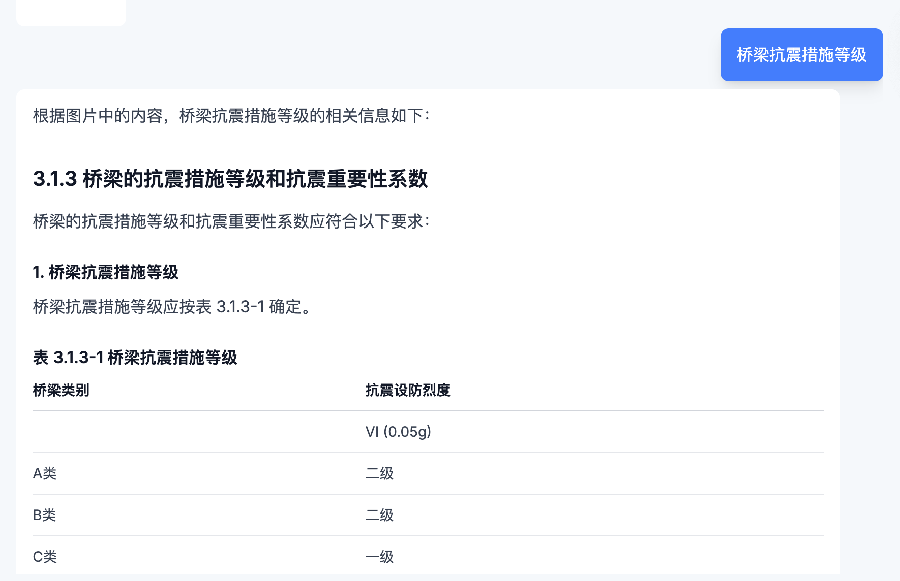

<div align="center">
  
</div>

<p align="center">
  <a href="./README.md">English</a> |
  <a href="./README_zh.md">简体中文</a>
</p>

# 🌌 KVisualRAG: Visual-Driven RAG Beyond OCR

> **Forget tokenization. Forget layout loss.**  
> With pure visual embeddings, KVisualRAG understands documents like a human—page by page, structure and all.

**KVisualRAG** is a next-generation Retrieval-Augmented Generation (RAG) system powered by **pure visual embeddings**. It treats documents as visually structured objects, not just token sequences—preserving layout, semantics, and graphical elements like tables, figures, and charts.

KVisualRAG is designed for both research and enterprise deployment, featuring:

- 🧑‍💻 **Modern Frontend**: [Next.js 15](https://nextjs.org/blog/next-15), [TailwindCSS 4.0](https://tailwindcss.com), TypeScript
- ⚙️ **Async Backend**: [FastAPI](https://github.com/fastapi/fastapi), async stack with **Redis**, **MySQL**, **MongoDB**, **MinIO**
- 🧠 **Visual Multimodal Foundation**: [Qwen2.5-VL](https://github.com/QwenLM/Qwen2.5-VL) as default LLM, with future support for **GPT-4o**, **Claude**, **Gemini**
- 🎯 **Image-level Embedding**: [Colpali](https://github.com/illuin-tech/colpali) + [colqwen2.5](https://huggingface.co/vidore/colqwen2.5-v0.2) for rich semantic vectors, stored in [Milvus](https://milvus.io/)

> KVisualRAG aims to be an **enterprise-ready, plug-and-play visual RAG platform**, bridging unstructured document understanding with multimodal AI.

---

## 📚 Table of Contents

- [Latest Updates](#-latest-updates)
- [Why KVisualRAG?](#-why-kvisualrag)
- [First Trial Version](#-first-trial-version)
- [System Architecture](#-system-architecture)
- [Key Features](#-key-features)
- [Tech Stack](#-tech-stack)
- [Deployment](#-deployment)
- [Use Cases](#-use-cases)
- [Roadmap](#-roadmap)
- [Contributing](#-contributing)
- [Contact](#-contact)
- [License](#-license)

---

## 🚀 Latest Updates

- **(2025.4.6) First Trial Version Released**: Upload PDF documents, ask questions, and get layout-aware answers. See [Roadmap](#-roadmap) for future plans.
- **Current Features**:
  - PDF batch upload & parsing
  - Visual-driven RAG for document QA
  - Optimized backend: **FastAPI**, **Milvus**, **Redis**, **MongoDB**, **MinIO**
- **Upcoming**:
  - More document formats (Word, PPT, Excel, images)
  - More LLMs (GPT-4o, Claude)
  - Intelligent Agent for multi-hop reasoning

---

## ❓ Why KVisualRAG?

Most RAG systems rely on OCR or text parsing, which leads to:

- ❌ **Loss of layout** (columns, tables, hierarchy)
- ❌ **No support for non-text visuals** (charts, images)
- ❌ **Semantic breaks from OCR segmentation**

**KVisualRAG changes this.**

> 🔍 It understands each page holistically, like a human reader.

With **pure visual embeddings**, KVisualRAG preserves:
- ✅ Layout (headers, lists, paragraphs)
- ✅ Table integrity (rows, columns, merged cells)
- ✅ Visual elements (charts, handwriting)
- ✅ Consistency between layout and content

---

## 🧪 First Trial Version

> ✅ **First version released!**  
> Upload your PDF, ask questions, and get layout-preserving answers.

### Screenshots

1. **Homepage**
   
2. **Knowledge Base**
   
3. **Interactive QA**
   
   

---

## 🧠 System Architecture

KVisualRAG's pipeline is **async-first**, **visual-driven**, and **scalable**.

### Query Flow
Embedding → Vector Retrieval → Answer Generation


### Upload & Indexing Flow
PDFs → Images → Visual Embedding (ColQwen2.5) → Metadata & Storage


---

## ✨ Key Features

| Feature                | Description                                      |
|-----------------------|--------------------------------------------------|
| 🧠 Visual-Driven RAG   | No OCR needed, direct image embedding            |
| 🧾 Layout-Preserving QA| Understands tables, headers, multi-column layout |
| 📊 Visual Content      | Handles charts, diagrams, non-text elements      |
| ⚙️ Async Parsing       | Background doc processing via Kafka              |
| 🔍 Fast Vector Search  | Scalable dense retrieval with Milvus             |
| 🤖 Flexible LLM Backend| Qwen2.5-VL, extensible to GPT-4o, Claude, etc.   |
| 🌐 Modern Web UI       | Next.js + TypeScript + TailwindCSS + Zustand     |

---

## 🧰 Tech Stack

**Frontend**:  
Next.js, TypeScript, TailwindCSS, Zustand

**Backend**:  
FastAPI, Kafka, Redis, MySQL, MongoDB, MinIO, Milvus

**Models**:  
Embedding: colqwen2.5-v0.2  
LLM: Qwen2.5-VL series

---

## 🚀 Deployment

### ▶️ Local Development

```bash
# Clone the repo
git clone https://github.com/weizxfree/KVisualRAG
cd KVisualRAG

# Configure environment
vim .env
vim web/.env.local
vim gunicorn_config.py
# Or use defaults

# Start dependencies (Milvus, Redis, MongoDB, Kafka, MinIO)
cd docker
sudo docker-compose -f milvus-standalone-docker-compose.yml -f docker-compose.yml up -d
cd ../

# Python env (optional)
# python -m venv venv && source venv/bin/activate
# Or with conda
conda create --name KVisualRAG python=3.10
conda activate KVisualRAG

# System dependencies (Ubuntu/Debian)
sudo apt-get update && sudo apt-get install -y poppler-utils
# Fedora/CentOS:
# sudo dnf install -y poppler-utils

# Install Python deps
pip install -r requirements.txt

git lfs install

# Download base model weights
git clone https://huggingface.co/vidore/colqwen2.5-base
# For users in China:
# git clone https://hf-mirror.com/vidore/colqwen2.5-base

# Download LoRA fine-tuned weights
git clone https://huggingface.co/vidore/colqwen2.5-v0.2
# For users in China:
# git clone https://hf-mirror.com/vidore/colqwen2.5-v0.2

# Modify the `base_model_name_or_path` field in `colqwen2.5-v0.2/adapter_config.json`
base_model_name_or_path="/absolute/path/to/colqwen2.5-base"
# Set it to local path of colqwen2.5-base

# Set the following in your .env file
COLBERT_MODEL_PATH="/absolute/path/to/colqwen2.5-v0.2"

# Initialize MySQL database
alembic init migrations
cp env.py migrations
alembic revision --autogenerate -m "Init Mysql"
alembic upgrade head

# Start backend
gunicorn -c gunicorn_config.py app.main:app
# or: nohup gunicorn -c gunicorn_config.py app.main:app > gunicorn.log 2>&1 &
# http://localhost:8000

# Start embedding server
python model_server.py

# Frontend
d cd web
npm install
npm run dev  # http://localhost:3000
# Or build: npm run build && npm start
```

> 🧪 Note: Milvus, Redis, MongoDB, Kafka, MinIO must be running locally or via Docker.

---

## 📚 Use Cases

- 🧾 **Intelligent Document QA**: contracts, invoices, scanned reports
- 🏛 **Policy/Legal Docs**: complex PDF parsing
- 🏭 **Industrial Manuals**: OCR-unfriendly layouts, tables, diagrams
- 📈 **Visual Analytics**: trend mining from charts

---

## 📦 Roadmap

- [x] PDF batch upload & parsing
- [x] RAG-based dialogue system
- [x] OpenAI-compatible API (ollama, sglang, vllm)
- [ ] Code modularity & scalability
- [ ] More visual/multimodal LLMs
- [ ] More doc formats (Word, PPT, Excel)
- [ ] Intelligent Agent for multi-hop reasoning
- [ ] Knowledge graph integration
- [ ] Docker Compose deployment
- [ ] Public Knowledge Base API

---

## 🤝 Contributing

Contributions welcome! Please open issues or pull requests.  
A CONTRIBUTING.md is coming soon for guidelines and best practices.

---

## 📫 Contact

**KnowFlow 企业知识库**  
🐙 [github.com/weizxfree/KVisualRAG](https://github.com/weizxfree/KVisualRAG)  
🔍 微信公众号：KnowFlow 企业知识库

---

## 📄 License

This project is licensed under the **Apache 2.0 License**. See [LICENSE](./LICENSE) for details.

---

> _KVisualRAG sees what OCR cannot. It reads documents like we do—visually, structurally, holistically._
